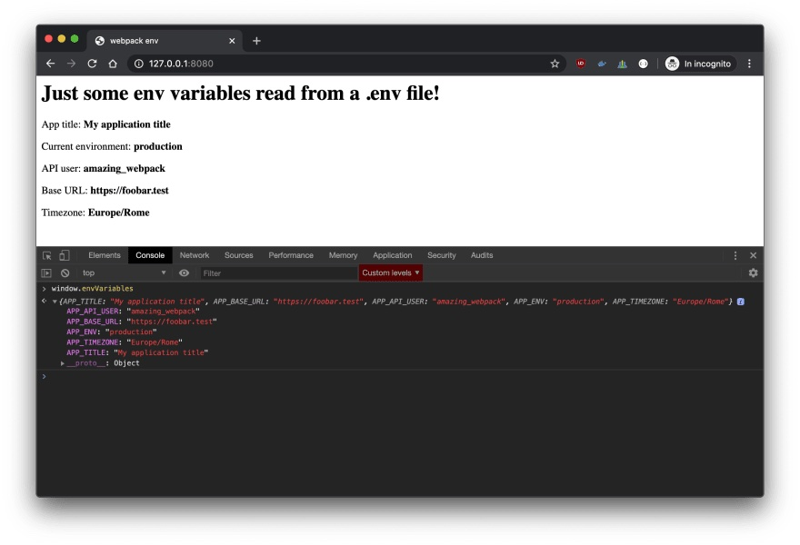

# webpack-env-file-variables
A simple JavaScript application to understand how to read env variables from a .env file by using webpack.



## Getting Started

First, install the dependencies:

```bash
npm ci
# or
yarn
```

Then build the project and run the server:
```bash
npm run build && npm run serve
```

Open [http://localhost:3000](http://localhost:3000) with your browser to see the result.

## Read more
If you want to go deeper, about the tech side of this project, you can read [the post](https://dev.to/sanfra1407/how-to-use-env-file-in-javascript-applications-with-webpack-18df#build-and-serve-the-app) I've written on my blog.